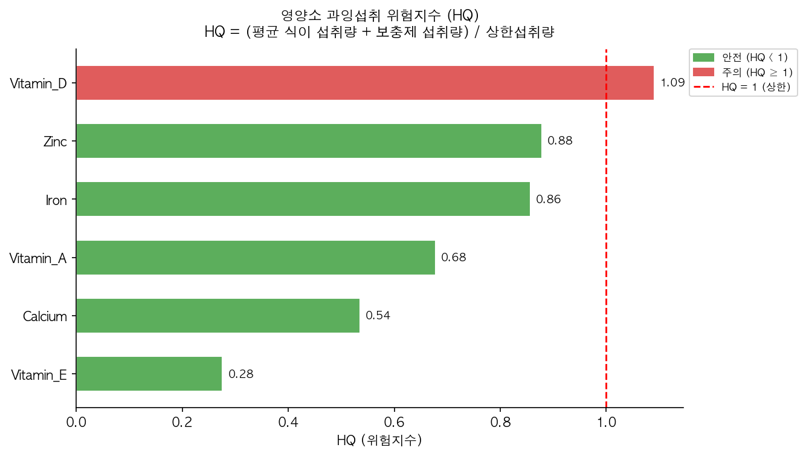
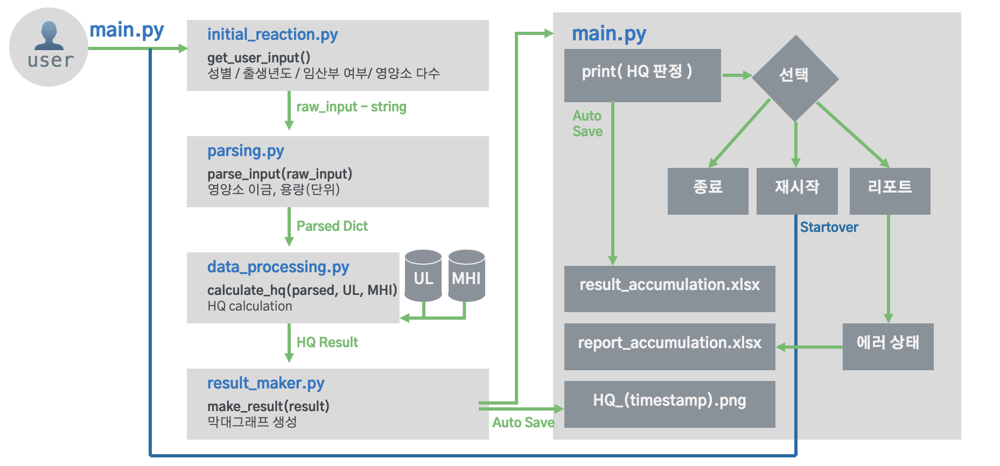

# HQ Analyzer — 영양제 섭취 위험도 평가 CLI

영양제 섭취량을 입력하면 **위험지수(HQ, Hazard Quotient)** 를 계산하고 시각화 결과를 저장합니다.

> HQ = (MHI + 섭취량) / UL
> HQ ≥ 1 이면 ⚠ 주의 / HQ < 1 이면 안전
>
> - **UL (Tolerable Upper Intake Level)**: 건강에 악영향 없이 섭취 가능한 최대량
> - **MHI (Minimum Hazard Intake)**: 위해가 시작되는 최소 섭취량

---

## 실행 환경

- Python 3.10 이상
- 필요 라이브러리: `pandas`, `openpyxl`, `scikit-learn`, `matplotlib`

---

## 설치 및 실행

```bash
# 1. 저장소 클론
git clone https://github.com/dohyun-jose-kim/HQ-CLI.git
cd HQ-CLI

# 2. 가상환경 생성 및 활성화 (uv 사용 권장)
uv venv .venv --python 3.10
source .venv/bin/activate

# 3. 라이브러리 설치
uv pip install -r requirements.txt

# 4. 실행
python main.py
```

---

## 사용 방법

실행하면 아래 순서로 입력을 요청합니다.

```
성별 (남성 / 여성): 남성
출생 년도 (예: 1994): 1993

영양소 입력: 철분: 15mg, 비타민D: 10ug, 아연: 20mg
```

- 영양소는 `영양소명: 용량단위` 형식으로 쉼표(`,`)로 구분해 한 줄에 입력합니다.
- `ug` 은 µg(마이크로그램)으로 자동 인식합니다.
- 입력 중 `--help` 를 입력하면 상세 안내를 볼 수 있습니다.
- 입력 중 `--vv` 를 입력하면 지원 영양소 목록을 볼 수 있습니다.
- 입력 중 어느 단계에서나 `q` 를 입력하면 즉시 종료합니다.

> **파싱 방식:** 하드코딩된 영양소 별칭 테이블로 1차 매핑하고, 매핑 실패 시에만 **TF-IDF 코사인 유사도 ML** 로 추정합니다. `main.py` 의 `DEV_MODE = True` 로 변경하면 레거시 개발 모드가 활성화됩니다.

---

## 지원 영양소 (15종)

| 분류 | 영양소 |
|------|--------|
| 비타민 | 비타민A, 비타민B6, 비타민C, 비타민D, 비타민E |
| 다량 미네랄 | 칼슘, 인, 나트륨 |
| 미량 미네랄 | 아연, 철분, 구리, 망간, 셀레늄, 몰리브덴, 요오드 |

한글·영문·원소기호 모두 입력 가능합니다.

---

## 출력 결과

실행 후 `results/` 폴더에 저장됩니다.



| 파일 | 설명 |
|------|------|
| `HQ_YYYYMMDD_HHMMSS.png` | 영양소별 HQ 막대 그래프 |
| `result_accumulation.xlsx` | 누적 결과 기록 |

---

## 파일 구조



```
HQ-CLI/
├── main.py                # 메인 실행 파일
├── initial_reaction.py    # 사용자 입력 수집
├── parsing.py             # 입력 파싱 (기본)
├── parsing_v1.py          # difflib 기반 fuzzy 매핑
├── parsing_v2.py          # TF-IDF 코사인 유사도 ML
├── data_processor.py      # HQ 계산
├── result_maker.py        # 시각화
├── requirements.txt
├── data/
│   └── preprocessed/
│       ├── 01_UL_Sex-Age_cleaned.xlsx   # 입력: 상한섭취량(UL) — 성별·연령별
│       └── 02_MHI_Sex-Age_cleaned.xlsx  # 입력: 최소위해섭취량(MHI) — 성별·연령별
└── results/                             # 실행 시 자동 생성
    ├── HQ_(timestamp).png               # 출력: 영양소별 HQ 막대 그래프 (실행마다 생성)
    ├── result_accumulation.xlsx         # 출력: 누적 결과 — timestamp / 성별 / 나이 / 연령범주 / 영양소별 HQ
    └── report_accumulation.csv          # 출력: 오류 보고서 — timestamp / 원본입력 / 파싱결과 / 메모 / 자동태그
```

---

## 데이터 출처

- 한국영양학회 한국인 영양소 섭취기준 (2020)
- 국민건강영양조사 2019–2020

---

*개발: 김도현 · 2026*
