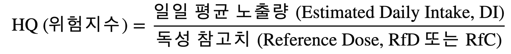

# 배경 & 데이터 설명

---

## 왜 영양 과잉을 평가하는가

건강기능식품 시장이 빠르게 성장하면서 영양제를 일상적으로 섭취하는 인구가 늘고 있다. 그러나 "영양제는 많이 먹어도 안전하다"는 인식이 널리 퍼져 있어, 과잉 섭취 위험에 대한 경각심이 부족한 상황이다.

특히 다음과 같은 문제가 있다:

- **중복/병용 섭취**: 여러 제품을 동시에 복용할 경우, 동일 영양소가 중복되어 의도치 않게 상한을 초과할 수 있다.
- **과잉의 비가역성**: 영양소 부족은 보충으로 회복 가능하지만, 과잉 섭취로 인한 독성(간 손상, 신경 손상 등)은 비가역적일 수 있다.
- **소비자 인식 부족**: 대부분의 소비자는 자신이 섭취하는 영양소의 상한섭취량(UL)을 알지 못한다.

이 프로젝트는 사용자가 자신의 영양제 섭취량을 입력하면, 해당 섭취가 안전 범위 내인지를 정량적으로 평가해주는 도구를 만들기 위해 시작되었다.

---

## HQ (Hazard Quotient) 개념

### 원형: 환경독성학의 위험지수

HQ(Hazard Quotient, 위험지수)는 환경독성학에서 화학물질의 위해도를 평가하기 위해 사용하는 지표다.

> **HQ = 일일 평균 노출량 (EDI) / 독성 참고치 (RfD)**

- **EDI** (Estimated Daily Intake): 하루 평균 노출량
- **RfD** (Reference Dose): 건강에 악영향이 없는 것으로 판단되는 기준 용량

### 적용: 식품안전 맥락으로 변환

이 프로젝트에서는 이화여대 협업 교수의 자문을 받아, 환경독성학의 HQ 개념을 식품안전(영양소 과잉 평가) 맥락으로 변환하여 적용했다.

> **HQ = (MHI + 보충제 섭취량) / UL**

- **MHI** (Minimum Hazard Intake): 식이를 통한 평균 섭취량 — 보충제 없이도 이미 섭취하고 있는 양
- **보충제 섭취량**: 사용자가 추가로 섭취하는 영양제 용량
- **UL** (Tolerable Upper Intake Level): 건강에 악영향 없이 섭취 가능한 최대량

| 대응 관계 | 환경독성학 (원형) | 식품안전 (적용형) |
|-----------|-------------------|-------------------|
| 분자 (노출량) | EDI | MHI + 보충제 섭취량 |
| 분모 (기준치) | RfD | UL |

### 해석 기준

| HQ 값 | 해석 |
|--------|------|
| HQ < 1 | 안전 — 상한섭취량 이내 |
| HQ >= 1 | 주의 — 상한섭취량 초과, 건강 위해 가능성 |

---

## 데이터 설명

데이터 출처는 **국민건강영양조사**이며, 원시 데이터를 전처리하여 사용한다.

### UL (Tolerable Upper Intake Level) — 상한섭취량

- **정의**: 건강에 악영향을 나타내지 않는 것으로 알려진, 영양소의 최대 일일 섭취량
- **출처**: 국민건강영양조사 데이터 전처리
- **파일**: `data/preprocessed/01_UL_Sex-Age_cleaned.xlsx`
- **구조**: 24행 (성별 2 x 연령범주 12) x 영양소 20종

포함 영양소 (20종):

| 분류 | 영양소 |
|------|--------|
| 비타민 | Vitamin A, Nicotinic acid, Nicotinamide, Vitamin B6, Vitamin C, Vitamin D, Vitamin E, Folate |
| 다량 미네랄 | Calcium, Phosphorus, Sodium, Magnesium |
| 미량 미네랄 | Copper, Iodine, Iron, Manganese, Molybdenum, Selenium, Zinc, Fluorine |

### MHI (Minimum Hazard Intake) — 최소위해섭취량

- **정의**: 식이(음식)를 통해 이미 섭취하고 있는 평균 섭취량. 보충제를 추가하기 전 기저 노출량에 해당한다.
- **출처**: 국민건강영양조사 데이터 전처리
- **파일**: `data/preprocessed/02_MHI_Sex-Age_cleaned.xlsx`
- **구조**: 24행 (성별 2 x 연령범주 12) x 영양소 17종

> **UL과의 차이**: Folate, Fluorine, Magnesium은 UL에는 있지만 MHI에는 없다. 해당 영양소는 HQ 계산 시 자동으로 건너뛴다.

### 연령범주 체계

| 범주 | 세부연령 |
|------|----------|
| 유아 | 1-2세, 3-5세 |
| 아동/청소년 | 6-8, 9-11, 12-14, 15-18 |
| 성인기 | 19-29, 30-49, 50-64 |
| 노년기 | 65-74, 75 이상 |
| 특수 (여성) | 임신부, 수유부 |
